# R1 - Identification of the problem you are trying to solve by building this particular app.

This app helps users to manage their vet appointments. The pet owners and veterinarians are able to register in the app. After logging into the app, pet owners are able to register their pets as patients, to book an appointment for their pets with a specific veterinarian, and to query, reschedule and cancel their bookings. Veterinarians are allowed to create, reschedule and cancel an appointment for a pet, and also allowed to query their bookings.

# R2 - Why is it a problem that needs solving?

There are several reasons why a vet appointments management system is needed:

1. Increase vet's customers satisfaction because the customers are able to manage their bookings anytime at anywhere.
2. Improve vet's working efficiency, e.g. veterinarians can view a patient's visit history in just a couple of seconds.
3. Reduce the risk of mistakes, e.g. double booking and missing customers' contact number.
4. Eco-friendly as the booking process becomes paperless.

# R3 - Why have you chosen this database system. What are the drawbacks compared to others?

PostgreSQL is selected as the database system for this app because of its own advantages. Firstly, PostgresSQL is a relational database system which works well with structured data, promotes high data integrity and benefits heavy duty transactional type apps. For this app, the data fits comfortably in rows and columns. Secondly, PostgreSQL provides multiplelevels security to safely and robustly store the data via authentication, access control, functions and rules, secure TCP/IPconnection etc. In order to use the functions of this app, users need to log into the app at the beginning.Lastly, PostgreSQL is an open source database system. It means that it can be used, modified and implemented as per this app's needs without any cost. However, PostgreSQL has some drawbacks compared to NoSQL database system which is document oriented. The biggest is that PostgresSQL is not flexible to store unstructured or little structured data. As all of the data stored in this app is well structured, this drawback will not affect the data management for this app.

# R4 - Identify and discuss the key functionalities and benefits of an ORM

SQLAlchemy is used in this app as an Object Relational Mapper tool. With it, object models can be mapped to the database, and we can query and manipulate the data directly from the database using Python because it can turn database tables, relationships, fields and records into objects. SQLAlchemy is simple to implement, helps a quick app development and doesn't require knowledge of SQL to get started. Without it, when developers want to interact with database, they have to write raw SQL queries and execute the queries in the program using connnectors. In that case, it is not convenient and prone to bugs because the raw SQL queries are often long, hard to modify and not optimal.

# R5 - Document all endpoints for your API

In this app, the body of API requests and the responses are all in the format of JSON.

- Prerequisites
  - Python 3.7 and newer
  - PostgreSQL 14.5 and newer

- Installation
  
  1. Clone/fork the repo (https://github.com/Hanzhi11/T2A2)
  2. Create an virtual environment
  3. Active the virtual environment
  4. Install the requirements with `pip install -r requirements.txt`
  5. Change `from flask.ext.autodoc.autodoc import Autodoc` to `from flask_autodoc.autodoc import Autodoc` in the __init__.py file at flask_autodoc folder
  6. Change `from jinja2 import evalcontextfilter` to `from jinja2 import pass_eval_context` and `@evalcontextfilter` to `@pass_eval_context` in the autodoc.py file at flask_autodoc folder
  7. Create a PostgreSQL database
  8. Create a .env file and add your database URL and JWT secret key to the file (i.e. DATABASE_URL = {your database URL}, JWT_SECRET_KEY = {your secret key})
  9. Create the tables in the database with the cli command `flask db create`. 
  10. Run the app with `flask run`, and test the `GET /documentation/` endpoint on an API platform e.g. Postman which was also used as an example for the following.

If everything works fine, you can get started with the following:

- Get access
  
   - Register an account
     - Customers: Use `GET /customers/register/` endpoint with required attributes of first_name, last_name, email, password and contact_name.
  
    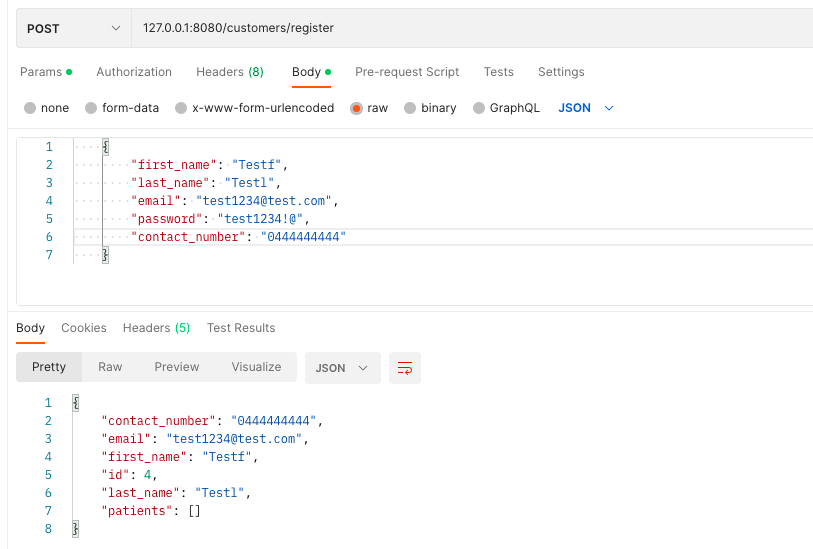

     - Veterinarians: Use `GET /veterinarians/register/` endpoint with required attributes of first_name, last_name, email, password, sex and is_admin and optional attributes of description and languages.

    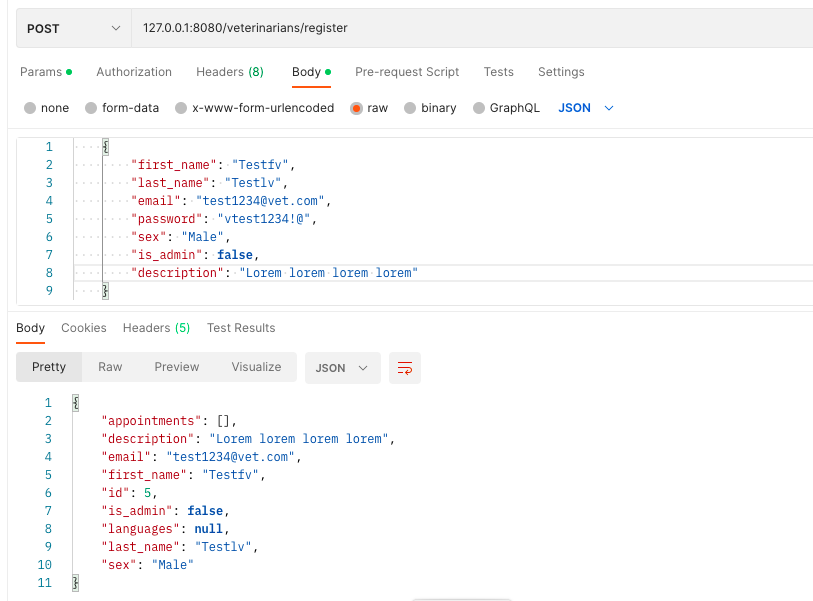

   - Notes
      1. Password must contain at lease 8 characters, and at lease one letter, one number and one special characters.
      2. Veterinarians' email must end with '@vet.com'.
      3. For trail purposes, you can use the cli command `flask db seed' to seed the database straight away, and then use the below information for authentication and authorization, and making API requests. Otherwise, you can seed the database by manually registering customers, patients and veterinarians, and booking appointments using appropriate API requests.
           - Customers: 'hamport@test.com' and 'Hamport1!'
           - Veterinarians:
              1. Admin: 'samsky@vet.com' and 'Samsky1?'
              2. General: 'gigisky@vet.com' and 'gigis11!'

- Authentication & Authorization
  
  This app uses user's email and password to authenticate user. Except the `GET /veterinarians/public` and `GET /veterinarians/1/public` endpoints, the users need to authenticate themselves by logging in the app using their email and password to reach the endpoints. Once the users login the app, they will get a JWT token for authorization purposes. At default, the token is only available for 24 hours unless the user logs out the app to revoke the token.

     - Customers: Use `POST /customers/login/` endpoint with their email and password to log in.
  
    

     - Veterinarians: Use `POST /veterinarians/login/` endpoint with their email and passwordto log in.

    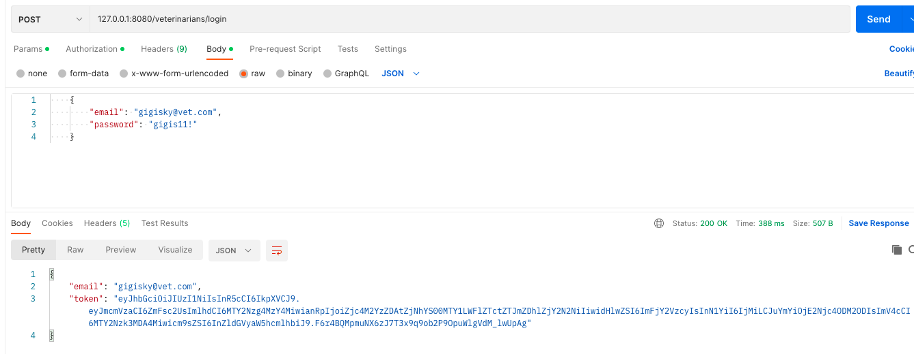

- Make REST API requests
  
  1. Enter the endpoint URL. A full list of endpoints can be found in the next section.
  2. Choose a proper method for the endpoint according to the request.
  3. Attach the JWT token in the authoriztion header of the request.
  4. Add the request body if needed.
  5. Send the request.

  The below is an example request for getting a customer's patients details.

  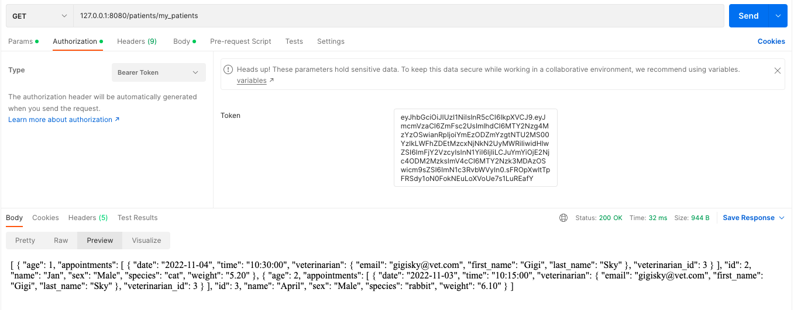

- Errors

  This app uses conventional HTTP response codes to indicate the success or failure of an API request. In general, Codes starting with 2 indicate success, with 4 for an error with the request, and with 5 for an server error.

  - 200 OK - Everything goes well.
  - 400 Bad Request - The request is not acceptable.
  - 401 Unauthorized - No valid token is provided.
  - 403 Forbidden - No valid type or value of the attribute is provided.
  - 404 Not Found - No valid endpoint URL is provided or No resource exists.
  - 405 Method Not Allowed - No property method is selected for the endpoint URL.
  - 409 Conflict - The request conflicts with the existing recource (e.g. one customer registers with an email which has existed in the database.)

- API Reference
  

# R6 - An ERD for your app

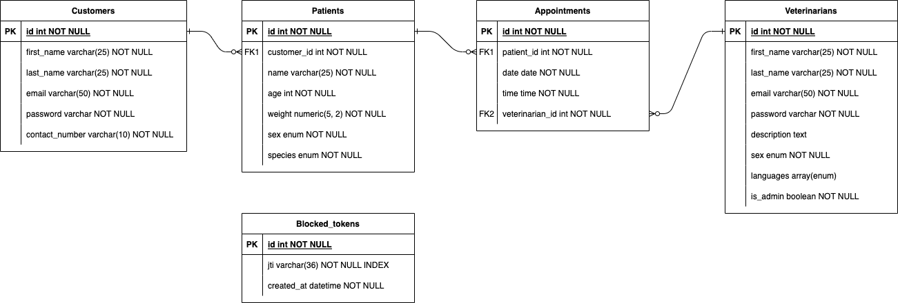

This app consists of five entities:

- Customers with attributs of id (primary key), first_name, last_name, email, contact_number and password, used to store customers' information.
- Patients with attributs of id (primary key), name, species, sex, age, weight and customer_id (foreign key), used to store patient's information.
- Veterinarians with attributs of id (primary key), first_name, last_name, email, password, is_admin, description, sex and languages, used to store veterinarian's information.
- Appointments with attributs of id (primary key), date, time, patient_id (foreign key) and veterinarian_id (foreign key). used to store appointments' information.
- Blocked_tokens with attributs of id (primary key), jti and created_at, used to store the revoked tokens.
  
The relationships between the entities are as below:

- Own: Custmers own patient (pet). One customer can own zero or many patients (pets), but one patient (pet) belongs to one customer.
- Have: Veterinarians have appointments. One Veterinarian can have zero or many appointments, but one appointment can be booked with one veterinarian.
- Belong: Appointments belong to patients. One appointment belongs to one patient, but one patient can have many appointments.

# R7 - Detail any third party services that your app will use

- PostgreSQL: A relational database management system.
- Psycopg2: A mature driver for interacting with PostgreSQL from the Python scripting language. It is written in C and provides a way to perform the full range of SQL operations against PostgreSQL databases.
- Flask: A micro web framework written in Python. Flask is used for developing the app using python, implemented on Werkzeug and Jinja2.
- Flask-SQLAlchemy: An extension for Flask that adds support for SQLAlchemy to the app. It aims to simplify using SQLAlchemy with Flask by providing useful defaults and extra helpers that make it easier to accomplish common tasks.
- Flask-Marshmallow: A thin integration layer for Flask and marshmallow that adds additional features to marshmallow, including URL and Hyperlinks fields for HATEOAS-ready APIs. It also integrates with Flask-SQLAlchemy.
- Marshmallow-Sqlalchemy: SQLAlchemy integration with the marshmallow (de)serialization library.
- Python-dotenv: Reads key-value pairs from a .env file and can set them as environment variables.
- Flask-JWT-Extended: Flask-JWT-Extended not only adds support for using JSON Web Tokens (JWT) to Flask for protecting routes, but also many helpful (and optional) features built in to make working with JSON Web Tokens easier: Adding custom claims to JSON Web Tokens, Automatic user loading, Custom claims validation on received tokens, Refresh tokens, Token revoking/blocklisting and Storing tokens in cookies and CSRF protection.
- Flask-Bcrypt: Provides bcrypt hashing utilities for the app (e.g. password).
- Marshmallow-enum: Enum field for use with Marshmallow.
- Flask-Autodoc: A Flask extension that automatically creates documentation for the endpoints based on the routes, function arguments and docstrings.

# R8 - Describe your projects models in terms of the relationships they have with each other

The Customer model has a one-to-many relationship with the Patient model. This relationship is expressed with the relationship() function. It points to the Patient model and loads multiple of patient objects. The back_populates parameter is used to declare a new property on the Patient model. Then `patient.customer` can be used to get to the owner of the patient. The cascade parameter is used to declare how operations performed on the customer object should be progagated to its child objects (i.e. patient objects). The `all, delete` argument means that when a customer object is deleted, its related patient objects will be deleted at the same time.

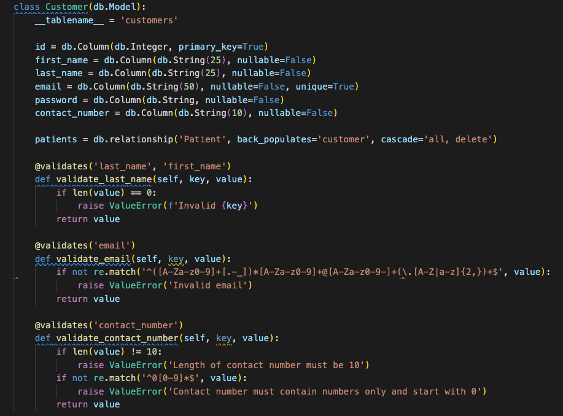

In the Patient model, its relationship with the Customer model is also defined with a relationship function which points to the Customer model. The back_populates parameter is used to declare a new property on the Patient model. Then `customer.patients` can be used to get to the patients of the customer.

The Patient model also has a one-to-many relationship with the Appointment model. The relationship() function is used to point the relationship to the Appointment model. The back_populates parameter is used to declare a new property on the Appointment model. Then `appointment.patient` can be used to get to the patient whom the appointment belongs to. The cascade parameter is used to declare how operations performed on the patient object should be progagated to its child objects (i.e. appointment objects). The `all, delete` argument means that when a patient object is deleted, its related appointment objects will be deleted as well.

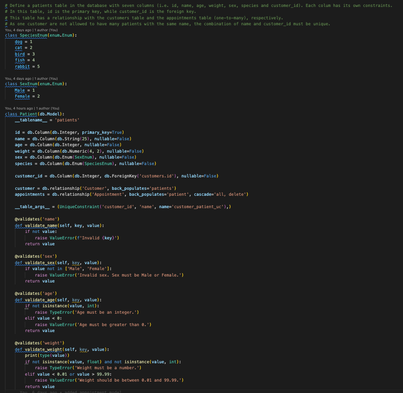

The Veterinarian model has a one-to-many relationship with the Appointment model. This relationship is expressed with the relationship() function as well. It points to the Appointment model. The back_populates parameter is used to declare a new property on the Appointment model. Then `appointment.veterinarian` can be used to get to the veterinarian whom the appointment is assigned to. The cascade parameter is used to declare how operations performed on the veterinarian object should be progagated to its child objects (i.e. appointment objects). The `all, delete` argument means that when a veterinarian object is deleted, its related appointment objects will be deleted as well.

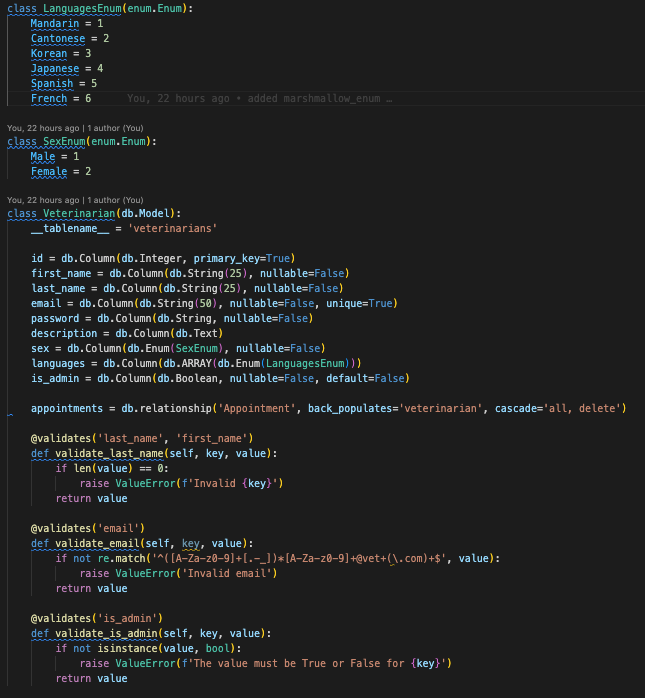

In the Appointment model, the relationship function connects it to the Veterinarian model and the Patient model, respectively. The back_populates parameter is used in both relationships to declare a new property on the Veterinarian model and the Patient model, respectively. Then `veterinarian.appointments` and `patient.appointments` can be used to get to veterinarian's and patient's appoinments, respectively.

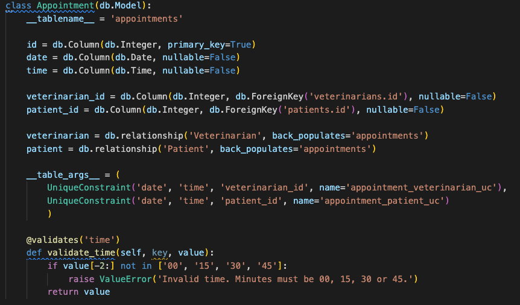

# R9 - Discuss the database relations to be implemented in your application

According to the ERD, five relations were implemented in the app:

- customers
  
  This table has 6 columns: 
  - id: the data stored in this column are integers and not null. id is also unique for each row of the table as it's the primary key of this table.
  - first_name: the data stored in this column are variable-length strings with the maximum of 25 characters, and not null as customers must have a first name.
  - last_name: the data stored in this column are variable-length strings with the maximum of 25 characters as well, and not null as customers must have a last name.
  - email: the data stored in this column are variable-length strings with the maximum of 50 characters, unique and not null as customers are not allowed to use the same email address.
  - password: the data stored in this column are variable-length strings without requirements on the maximum length, and not null as customers need a password to log in the app.
  - contact_number: the data stored in this column are variable-length strings with the maximum of 10 characters, and not null as the clinic must have customers' contact number in record.
  
  To establish its one-to-many relationship with the patients table, its id column is used in the patients table for reference.
  
  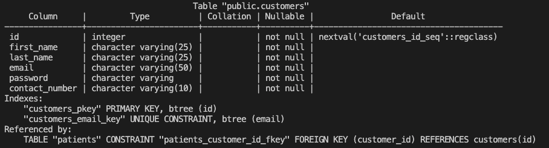

- patients
  
  There are 7 columns in this table:
  - id: the data stored in this column are integers and not null. id is also unique for each row of the table as it's the primary key of this table.
  - name: the data stored in this column are variable-length strings with the maximum of 25 characters, and not null as patients must have a name.
  - age: the data stored in this column are integers, and not null as patients must have an age.
  - weight: the type of the data stored in this column is numeric with the precision of 5 and the scale of 2, and the value of the data is not null as patients must have a weight.
  - sex: the type of the data stored in this column is enumeration which contains a set of named values (Male and Female), and the value of the data is not null as patients must have a sex.
  - species: the type of the data stored in this column is enumeration which contains a set of named values (dog, cat, fish, rabbit and bird), and the value of the data is not null as patients must have a species.
  - customer_id: the data stored in this column are integers and not null. customer_id is a foreign key in this table which is used to refer to a record in the customers table.

  To avoid conflicts, the combination of customer_id and name must be unique as the customers are not allowed to have pets with the same name.

  To establish its one-to-many relationship with the appointments table, its id column is used in the appointments table for reference.

  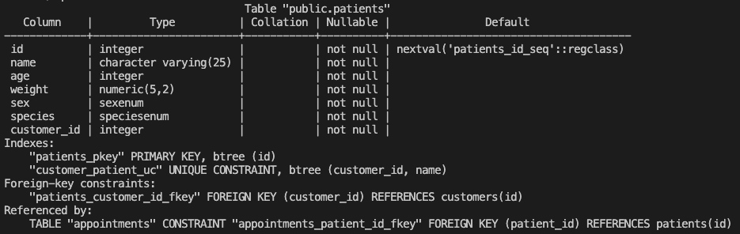

- veterinarians
  
  This table has 9 columns: 
  - id: the data stored in this column are integers and not null. id is also unique for each row of the table as it's the primary key of this table.
  - first_name: the data stored in this column are variable-length strings with the maximum of 25 characters, and not null as veterinarians must have a first name.
  - last_name: the data stored in this column are variable-length strings with the maximum of 25 characters as well, and not null as veterinarians must have a last name.
  - email: the data stored in this column are variable-length strings with the maximum of 50 characters, unique and not null as veterinarians are not allowed to use the same email address.
  - password: the data stored in this column are variable-length strings without requirements on the maximum length, and not null as veterinarians need a password to log in the app.
  - description: the data stored in this column are texts without character limitations. It can be null as it's not nessacery for veterinarians to have one.
  - sex: the type of the data stored in this column is enumeration which contains a set of named values (Male and Female), and the value of the data is not null as veterinarians must have a sex.
  - languages: the type of the data stored in this column is enumeration which contains a set of named values (Mandarin, Cantonese, Korean, Japanese, Spanish and French). The value of the data can be null as veterinarians are not required to speak other languages, except English.
  - is_admin: the data stored in this column are booleans, and not null with the default value of False.
  
  To establish its one-to-many relationship with the patients table, its id column is used in the patients table for reference.

  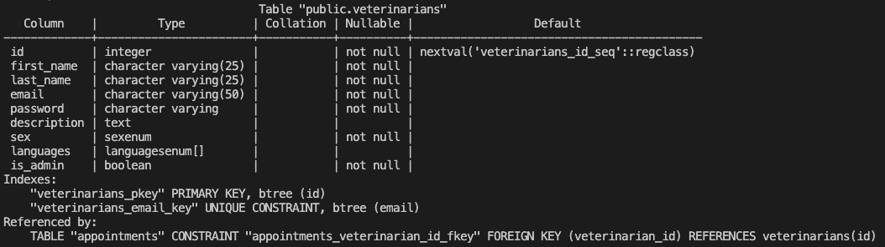
- appointments
  
  This table has 5 columns: 
  - id: the data stored in this column are integers and not null. id is also unique for each row of the table as it's the primary key of this table.
  - date: the data stored in this column are dates, and not null as appointments must have a date assigned.
  - time: the data stored in this column are times, and not null as appointments must have a time assigned.
  - veterinarian_id: the data stored in this column are integers and not null. veterinarian_id is a foreign key in this table which is used to refer to a record in the veterinarians table.
  - patient_id: the data stored in this column are integers and not null. patient_id is a foreign key in this table as well and is used to refer to a record in the patients table.

  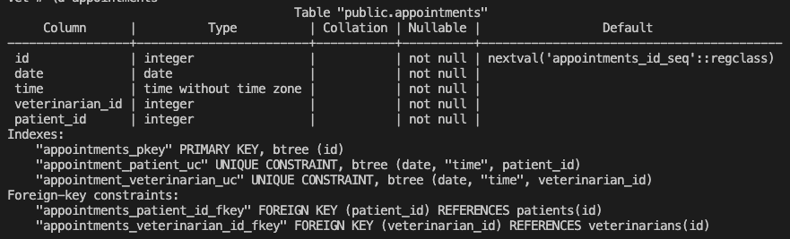

- blocked_tokens
  
  This table has 3 columns:
  - id: the data stored in this column are integers and not null. id is also unique for each row of the table as it's the primary key of this table.
  - jti: the data stored in this column are unique identifiers for the revoked tokens, and not null. 
  - created_at: the data stored in this column are datetimes when the tokens were revoked, and not null. Making jti an index can significantly speed up the search when there are
  tens of thousands of records.

  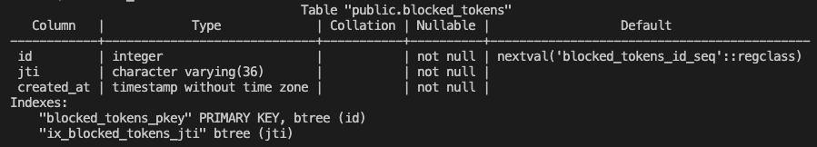

# R10 - Describe the way tasks are allocated and tracked in your project

Trello was used to manage the project (https://trello.com/b/b80ZSFMK/t2a2). Three lists (i.e. To Do, In Progress and Done) were created at the start of the project in order to allocate and track the progress of tasks. According to the requirements of the project, the whole project were divided into six main tasks: Decide app functions, design ERD for database, design API endpoints, App development which consists of three sub-tasks (i.e. app setup, app models and app controllers), API documentation and Readme document. The priority of each task was indicated by a color bar at the top of each card. A due date was also setup for each task.

Once all of the tasks are determined, their corresponding cards were placed at the To Do list, and sorted by their priority in descending order and due date in asceding order. Only the first card on the To Do list was selected to work on at each time and then moved to the In Progress list, and there was always only one card in the Progress list due to the working capacity. Once the task was completed, the card was moved to the Done list and changed its status to complete. For example, on day 2, the Decide app functions and design ERD for database tasks have been completed so their cards were moved to the Done list with a complete status. The first task for that day was Design API endpoints, so its card was moved to the In Progress list accordingly. Once the task was completed, its card was moved to the Done list with a complete status. Then the App development task started and its card was moved to the In Progress list. When all of the cards have been moved to the Done list, the whole project is completed.

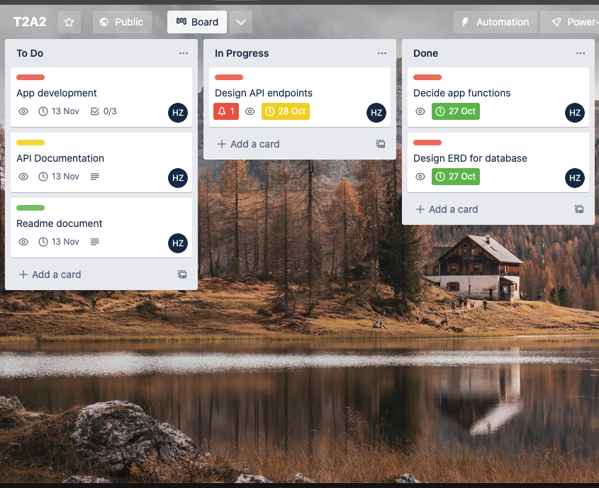
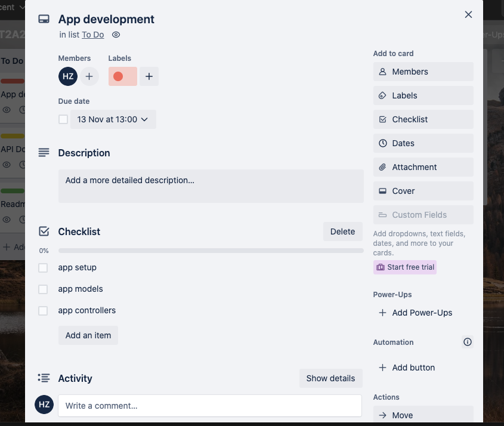

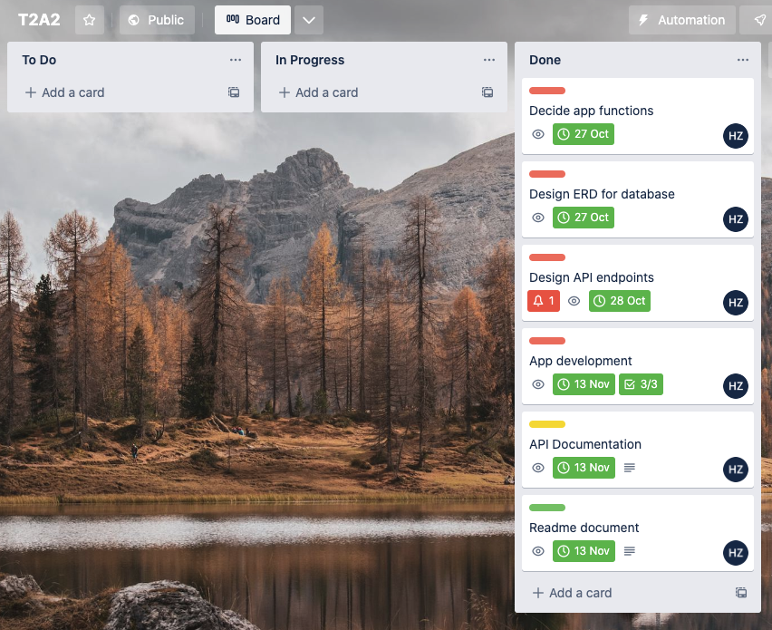